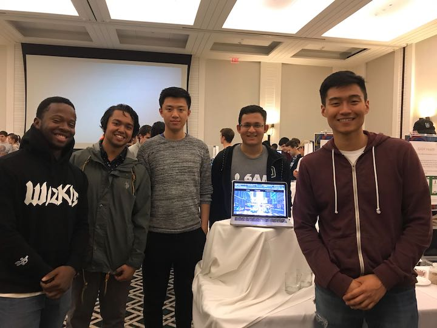
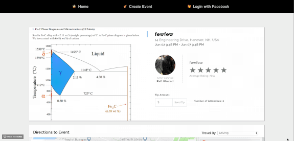
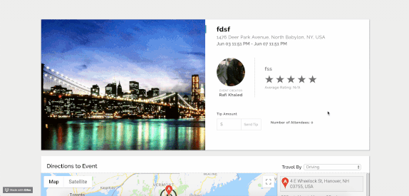
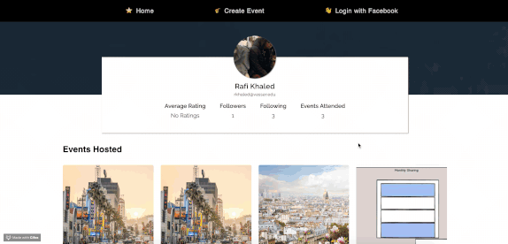

# Busking

A decentralized platform that empowers street performers to publicize their musical events. This democratizes information so that more people can support up-and-coming artists in their region.

## Product Demos

***Landing Page***

***Map View***

***Payment***

***User Profile***

## Tech Stack
- React.js, Redux, Node.js/Express, MongoDB.

## Architecture
### API's used
- **Google Maps Javascript API**
	- We used the Google Maps Javascript API to display events on a map
- **Geolocation API**
	- We used the Geolocation API to determine the user's location and sort events based on proximity to user.
- **Google Directions API**
	- We used the Google Directions API to display directions from the user's location to an event. These directions were rendered on the map and as step by step instructions.
- **Google Geocoding API**
	- We used the Google Geocoding API to convert places to latitude and longitude. This allowed for a better user experience as users did not have to enter the longitude and latitude of their event location.
- **Google Places API**
	- We used the Google Places API to convert latitude and longitude to actual addresses. This was used in the event sorting algorithm to display events closer to the user first. 
- **Stripe Connects API**
	- we used the Stripe Connects API to build the payments infrastructure for our app. 
	- From a user flow perspective, users can **directly** receive tips from the public by either linking their own Stripe account into our platform or going through the Stripe Connect OAuth flow to create their Stripe accounts. Then, they will be **redirected** to our landing page to see the full list of events.
	- **LINKING STRIPE:** A user can go to my profile and click **Stripe Connect**, which will re-directed them to Stripe Oauth flow. For testing purposes, you can just sign in to stripe and click `Skip the account form`, as you don't want to spend `~30 mins` to fill up a form. Clicking `Skip the account form` will redirect you back to the home page!
	- If a user doesn't have Stripe account linked to their user profile, then Busker receives the tip on the Busker dashboard and can reconcile the balance with the perfomer afterwards.
- **AMAZON S3**
	- we enabled amazon S3 so that users can seemlessly upload their images when creating events. This makes more sense from a user-flow perspective than having them upload a link.

## Frontend 
### Home
We have a landing page that displays all the events, has a search bar to look up a particular event, toggle to map view, filter events! Users can also toggle into map view and we use **GEO-LOCATION API** to show the users the events that are nearby to them.
 	

### Create Event
We render a beautiful form for the users to enter their newly created event.

### Events
The following features are associate with each event: 

	 1. Time
	 2. Longitude, Latitude
	 3. Description
	 4. Title
	 5. Average User Rating
	 6. comments
	 7. attendees
	 8. Stripe Id (to pay directly to the users)

### Profiles
		- Each user has profile page that displays the following information:
		1. Their average ratings from their peers
		2. A list of people they follow
		3. A list of people they are following.
		4. The number of events they attended.
		5. Users can also see a list of events that they hosted and attended.
	
### Sign up
We used Facebook authentication to sign users into a platform. We used the `Facebook Strategy` using Passport.js and use sessions so that when users refresh the page, they are still logged in!

### Testing Connect Stripe and Payment Integration
Search for a pinned post in our slack busking channel for account details to log into our central Stripe Busking Dashboard. Note, you can `skip account creation` when taken to the OAuth flow page of Stripe since for testing purposes, there is no need to fill out that long form.

## Setup

Clone both the front-end and back-end and run `yarn` to install all the project dependencies. Make sure you have a mongo process running in another terminal in the background with `mongod &`.  Make sure you have the `config.js` file added so that Facebook authorization stategy works! Then run `yarn start` in the front-end, `yarn-dev` in the backend, to load the project locally. Navigate to `localhost:8080` to to view the app.

## Deployment

We deployed the both the front-end and back-end using **Heruko**. See our deployed project at [Busker](https://busking.surge.sh/)

## Documented Bugs
1. When we use the [react-datetime-picker](http://projects.wojtekmaj.pl/react-datetime-picker) library, the creators of the library did not add input validation to their code. This allows users to enter times like **4:0000 pm** or **5:001 pm**, a bunch of trailing zeros that have no meaning. Since we did not write this library, its impossible for us to change it without issuing a pull request to the creators of this library. 
2. Sometimes, we get a React`mapCenter` console.log warning in the browser. This problem is occuring because `react-google-maps` prop name is called `center` whereas google browser expects the prop name to be called `mapCenter`. Other than issuing a pull request to the creators of this library, there is little else to do. Thankfully, functionally everything works!
3. Side note: When testing locally using local host, Facebook auth will complain that "The method FB.api will soon stop working when called from http pages. Please update your site to use https for Facebook Login." This is simply a security warning from Facebook's side that goes away when we go to the deployed version on surge that uses HTTPS.
4. You may get a 'POST https://checkout.stripe.com/api/account/verifications 400' error. This may happens because the `stripe-checkout-library` that we are using insists that we use sms to verify our accounts. There is not that we can do on our end here since we do not control the network request that this library is trying to make here. You can safely ignore this error as it does not affect functionality.

## Authors

Xingran Zhuang '19, Rafi Khaled '20 , Tianxing Dai '20, Chikezie Onungwa '20, Yakoob Khan '21

## Acknowledgments
We have to thank Tim for teaching us web-dev this term! Hat's off to all the hard work of the TA's for making CS 52 such an amazing and supportive class. It helped us make this project from the ground-up a success and something that we are proud to display to others after this class.
